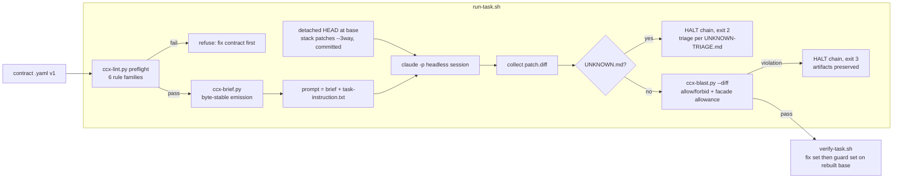

# feat: CCX thin harness — productize the contract-pilot toolkit

## Summary

Build the thin harness mandated by the pilot's STRONG result and the v3 decision rule (`docs/brainstorms/2026-07-06-context-closed-tasks-v3.md` §4 item 1): a small, Git-compatible toolkit under `tools/ccx/` — files and scripts only, **deliberately no new Forge objects** — that turns the pilot's duct tape (`experiments/ccx/brief.sh`, `blast-check.py`, `run-arm-a-stacked.sh`, the UNKNOWN.md convention) into durable, tested tooling. Every component transcribes a named defect from the 2026-07-06 pilot arc; nothing here is speculative. The follow-up dogfood target (out of this plan's scope, next in queue) is completing NER-362 through this harness.

---

## Problem Frame

The pilot proved contracts beat history transfer (0 vs 21+ implementation defects), but every Arm A defect was in the **contracts** — five contract-defect classes, one runner bug, and one review-only P1 are documented in the three 2026-07-06 `docs/solutions/` entries and v3 §2. The pilot scripts encode the working mechanics but are hardwired to pilot task IDs, live in a frozen experiment record, use fragile text extraction (grep/sed neighbor parsing — the BSD-sed `[[:space:]]` incident), and have no lint, no self-tests, and a hardcoded acceptance-command table. NER-362 completion and pilot 2 are both blocked on a reusable harness.

**Requirements traceability** (each maps to a v3 §2 earned commitment, backed by a named defect):

| R-ID | Requirement | Earned by |
|------|-------------|-----------|
| R1 | Brief emitter: byte-stable, neighbor resolution, fail-closed on missing contract | v3 §2.7; pilot `cmp`-verified requirement |
| R2 | Contract lint v0: six rule families (parse, satisfiability, primitive visibility, acceptance non-vacuity, exclusion clause, command grammar) | v3 §2.5, §2.1; all five scorer contract-defect findings + the retired hardcoded command table |
| R3 | Blast-radius check with standing facade allowance (decl/re-export lines in facade files always permitted) | v3 §2.4; A-382-2 blast violation + 362-1 cap collisions |
| R4 | UNKNOWN.md stop convention (verbatim) + triage flow — an unanswered unknown teaches guessing | v3 §4.1; stop-on-unknown solution doc (three-leg rule) |
| R5 | Dependency-ordered runner: stack predecessors' patches committed on a detached HEAD, `--3way` apply, halt-on-unknown | v3 §2.6; pilot amendment P1 (branch-pointer bug) |
| R6 | Acceptance fix/guard split: must-fix + must-not-regress command sets per contract | v3 §2.3; 4 Arm B verifier defects + vacuous `-p forge-store provenance` filter |
| R7 | Harness is itself tested: each lint rule provably catches its defect class; brief emission provably byte-stable | Plan quality bar; gate-layering solution doc |

---

## Key Technical Decisions

- **KTD1 — Home: new `tools/ccx/` directory.** `experiments/ccx/` is the frozen pilot evidence record (cited by RESULTS.md, PR #124) and must not mutate; `scripts/` is CI/dogfood gates for the Rust workspace. A separate `tools/ccx/` signals durable, workspace-independent tooling. Pilot scripts stay untouched.
- **KTD2 — Python 3 + PyYAML for anything that reads contract YAML** (lint, brief emitter, blast check); bash only for the runner/verify orchestration (git + process choreography, mirroring the pilot scripts that already work). Rationale: the pilot's grep/sed neighbor extraction is exactly the fragility class that caused the BSD-sed incident, and lint rule 1 ("YAML-parseable") requires a real parser anyway. PyYAML 6.x is present on the dev machine; every script that imports yaml fails closed with an actionable install message if missing.
- **KTD3 — Contract schema bumps to `ccx.contract.v1`**, additive over v0: `acceptance` becomes `{fix: [...], guard: [...]}` (R6); new optional keys `primitives:` (name + crate + expected visibility, for lint rule 3), `exclusion_contract:` (required by lint rule 5 when the task enumerates the filesystem), `depends_on:` (task-contract IDs, feeding the runner's stack order). Lint accepts v0 contracts with downgrade warnings (the frozen pilot contracts must remain lintable for comparison) and applies full strictness to v1. A schema reference doc in `tools/ccx/` is the normative description.
- **KTD4 — The stop rule is single-sourced.** The task-instruction block (currently duplicated verbatim across `run-arm-a.sh` and `run-arm-a-stacked.sh`) moves to one versioned file, `tools/ccx/prompts/task-instruction.txt`, that the runner appends to every brief. The stop-on-unknown solution doc's three legs are: mechanical stop convention (this file), stops-scored-as-success (README states it), triage flow that answers unknowns (R4 doc).
- **KTD5 — Blast check gains a statement-aware git-diff mode.** The facade allowance (R3) cannot be evaluated from `changed_paths` alone — it needs hunk contents to verify facade-file changes are decl/re-export-only. Primary input becomes a unified diff (`patch.diff` from the runner, or `git diff` output). Facade classification is **statement-aware, not per-line**: rustfmt wraps re-exports across lines (`pub use foo::{A,` / `    B};`), and the recorded `experiments/ccx/runs/A-382-2-r2/patch.diff` facade hunk consists of bare identifier continuation lines inside a multi-line `pub use` block — a per-line rule would mis-flag exactly the change the allowance exists to license. The check therefore requires every changed line span in a facade file to fall within a (possibly multi-line, brace-balanced) `mod` declaration or `pub`/`pub(crate)` `use` statement, an attribute line on such an item, a comment, or blank. The forge-envelope path-level mode is retained for `forge propose --json` piping with **unchanged pilot semantics** (violation = report + exit 2; a facade path outside the allowlist is a violation whose report notes "rerun in --diff mode for line-level facade allowance") — envelope mode introduces no new verdicts, deliberately not pre-empting the NER-383 refusal-semantics decisions.
- **KTD6 — Satisfiability lint uses the existing cap allowlist.** Lint rule 2's "allowed_changes satisfiable" check reuses the ceiling data of `scripts/check-rust-line-count.sh` (global 3000 + `allowed_cap` exceptions, e.g. `forge-content-native/src/lib.rs` at exactly 4730). The allowlist lives as a bash `case` statement, so lint extracts entries at runtime by regex-parsing the `allowed_cap()` case arms (`crates/....rs) echo NNN ;;`), with a self-test asserting the known entry parses — allowlist edits propagate automatically and shape drift fails loudly instead of silently. Glob semantics: `allowed_changes.paths` globs expand against the worktree; a glob matching any uncapped file, or any allowed path that does not yet exist (a new file the task may create), makes the contract satisfiable. Error only when every existing allowed file is at/over its cap and no new-file room exists; any single capped allowed path yields a warning naming the cap.
- **KTD7 — Runner pre-flights lint and post-flights blast.** A contract that fails lint never reaches an agent (fail-closed, R1/R2 composition); a produced patch is immediately blast-checked so violations are caught at collection time, not review time.
- **KTD8 — Harness self-tests wired into both CI surfaces.** One line in `scripts/ci.sh` invoking `tools/ccx/tests/run-tests.sh` (pure-local, seconds, no network/agent), **and** a matching step in `.github/workflows/ci.yml` — the workflow does not invoke `scripts/ci.sh` (it duplicates each check as a separate step), so wiring only the script would leave the gate silently absent post-merge while breaking the local-mirror invariant. The ci.yml step ensures PyYAML availability on the runner (`python3 -c "import yaml" || python3 -m pip install --user pyyaml`) before running the suite. Rationale: gate-layering doc — untested gates are Goodhart bait. Runs after the cargo trio, before the e2e eval.

---

## High-Level Technical Design

Task lifecycle through the harness (the runner orchestrates; every box is independently invocable):



Contract schema delta v0 → v1 (directional, normative text lives in the schema doc):

```yaml
schema: ccx.contract.v1
acceptance:
  fix:    [ ... ]   # must pass; the task's own proof
  guard:  [ ... ]   # must not regress; pre-existing behavior
primitives:          # optional; lint rule 3 checks existence + visibility
  - { name: tree_fingerprints, crate: forge-content-native, visibility: pub }
exclusion_contract: >   # required by lint when task enumerates the filesystem
  enumerate via walk_worktree semantics (policy + .forgeignore + .gitignore)
depends_on: [ ccx-task-362-1-provenance-walk ]   # runner stack order
```

---

## Scope Boundaries

**In scope:** the six harness components (R1–R6), their self-tests (R7), the v1 schema doc, the UNKNOWN triage doc, CI wiring (KTD8). All on branch `experiment/ccx-spikes`.

**Out of scope / deferred to follow-up work:**
- **NER-362 completion** (tip-resolution contract revision, reruns, promotion round) — the dogfood, immediately next, exercised *through* this harness once it exists.
- **Pilot 2 (neighbor ablation) and pilot 3 (CooperBench)** — v3 §4 items 3–4.
- **Any Forge-native substrate** (contract records, `forge brief`, `forge unknown`, merge gates) — explicitly forbidden by the decision-rule boundary until roadmap items 1–4 complete.
- **Rewriting/migrating the frozen pilot contracts in `experiments/ccx/contracts/`** — they stay v0; lint's v0 compatibility covers them read-only. The NER-362 contract *revisions* (v1) happen in the dogfood, not here.
- **NER-383 refusal-semantics decisions** — Jan's call; blast check keeps pilot semantics (violation = report + exit 2) and does not pre-empt them.
- **LLM-assisted lint or brief generation** — v0 is deterministic-only by design.

**Outside this product's identity:** replacing the ce-* review gates. Contract green licenses integration, never merge (gate-layering doc); the harness's verify step is the *acceptance* layer only.

---

## Assumptions

Recorded because this run proceeded without a scoping confirmation (autonomous session):

- **A1:** `tools/ccx/` is an acceptable new top-level directory (vs. `scripts/ccx/`). Chosen for the frozen-experiments / CI-scripts separation argument in KTD1.
- **A2:** PyYAML as a documented dev dependency is acceptable for a files+scripts harness (no vendoring, no requirements.txt machinery; a one-line install hint on ImportError).
- **A3:** Adding the harness self-test line to `scripts/ci.sh` (KTD8) is desirable on this branch; trivially revertible before any merge discussion if Jan disagrees.
- **A4:** Runner keeps the pilot's `claude -p --output-format json --dangerously-skip-permissions` invocation shape, parameterized, since that is the validated harness-side injection surface (U5 of v3 carries the real design forward to the substrate phase).

---

## Implementation Units

### U1. Harness skeleton, contract schema v1, and single-sourced prompts

**Goal:** `tools/ccx/` exists with the normative schema doc, the versioned task-instruction file, and the README that states the harness's contract (including stops-are-successes).
**Requirements:** R4 (convention half), R6 (schema half); foundation for all others.
**Dependencies:** none.
**Files:** `tools/ccx/README.md`, `tools/ccx/CONTRACT-SCHEMA.md`, `tools/ccx/prompts/task-instruction.txt`, `tools/ccx/UNKNOWN-TRIAGE.md`.
**Approach:**
- `CONTRACT-SCHEMA.md` specifies `ccx.contract.v1` per KTD3: every v0 key, plus `acceptance.fix`/`acceptance.guard`, `primitives`, `exclusion_contract`, `depends_on`; states v0-compat rules (flat `acceptance:` list ⇒ treated as fix set + warning).
- `prompts/task-instruction.txt` carries the stop rule **verbatim from `experiments/ccx/run-arm-a.sh`** (KTD4) — the wording is validated by 13/13 observed stops; do not editorialize. Only permitted delta: reference the fix/guard split ("run the contract's acceptance.fix commands and make them pass; acceptance.guard commands must not regress").
- `UNKNOWN-TRIAGE.md` encodes the three-leg rule from the stop-on-unknown solution doc: (1) every filed UNKNOWN.md is answered before any rerun of that task or its dependents — answer = contract revision (bump `revision:`, comment the resolution, as `task-382-2-drift-guard.yaml` rev 2 models) or an explicit rejection recorded in the triage log; (2) a correct stop is recorded as a SUCCESS outcome wherever runs are tallied; (3) never rerun into an unanswered unknown — the runner enforces the halt, the triage doc owns the human flow.
- README states the decision-rule boundary (no Forge objects), points to the three solution docs, and documents the PyYAML prerequisite.
**Patterns to follow:** frontmatter/tone of `experiments/ccx/PILOT.md`; the global-policy `unknown_rule` phrasing.
**Test scenarios:** Test expectation: none — documentation and static assets; enforced indirectly by U2–U6 tests that consume them (e.g., U5 asserts the runner injects `task-instruction.txt` byte-for-byte).
**Verification:** docs exist; task-instruction stop-rule text diffs clean against the `run-arm-a.sh` heredoc (modulo the licensed fix/guard delta).

### U2. Brief emitter `ccx-brief.py`

**Goal:** Byte-stable brief emission with YAML-native neighbor resolution, fail-closed.
**Requirements:** R1.
**Dependencies:** U1 (schema).
**Files:** `tools/ccx/ccx-brief.py`, `tools/ccx/tests/test_brief.py`, `tools/ccx/tests/fixtures/` (mini contract set).
**Approach:**
- Port `experiments/ccx/brief.sh` semantics: emit global policy, then task contract, then neighbor contracts one level deep in declared order, with the same `--- SECTION ---` framing (scorers and prompts already understand it).
- Neighbors come from the parsed YAML `neighbors:` list, not grep/sed (KTD2 — retires the BSD-sed fragility). Resolution rule (`ccx-<name>` → `<contracts-dir>/<name>.yaml`) preserved.
- Byte-stability: output is a pure function of input file bytes — no timestamps, no env, no dict-iteration nondeterminism (emit source text verbatim, never re-serialize YAML).
- Fail-closed: missing contract file or missing/unreadable global policy ⇒ nonzero exit, nothing on stdout. Missing neighbor ⇒ keep the pilot's explicit `NEIGHBOR CONTRACT MISSING … (surface as unknown, do not guess)` marker (validated behavior; lint rule 1 catches it earlier at authoring time).
- CLI: `ccx-brief.py --contracts-dir <dir> --global-policy <file> <contract.yaml>`; defaults resolve within the contracts dir.
**Patterns to follow:** `experiments/ccx/brief.sh` output framing; `blast-check.py` argparse/docstring style.
**Test scenarios:**
- Happy path: fixture contract with two neighbors emits policy + contract + both neighbors in declared order with exact framing lines.
- Byte-stability: two invocations produce `cmp`-identical bytes; permuting an unrelated fixture file changes nothing.
- Missing neighbor: emits the MISSING marker for the absent id, exit 0.
- Missing contract: exit nonzero, empty stdout.
- Missing global policy: exit nonzero, empty stdout (fail-closed, not silently policy-less — the no-brief negative control showed why).
- v0 contract (pilot fixture copied verbatim): emits identically to the recorded pilot brief for that task (regression pin against `experiments/ccx/runs/` brief.txt where available).
**Verification:** test suite green; a real emission for a pilot contract byte-matches the pilot's recorded `brief.txt`.

### U3. Contract lint `ccx-lint.py`

**Goal:** The five defect classes that shipped in pilot contracts become machine-caught before any agent run.
**Requirements:** R2.
**Dependencies:** U1 (schema doc is the rule source).
**Files:** `tools/ccx/ccx-lint.py`, `tools/ccx/tests/test_lint.py`, fixture contracts under `tools/ccx/tests/fixtures/` — one minimal PASS contract plus one fixture per defect class.
**Approach — rule families (each transcribes a named pilot defect):**
1. **Parse + shape:** valid YAML; required keys present (`schema`, `id`, `revision`, `ticket`, `task`, `interface`, `acceptance`, `allowed_changes`, `authority`); `schema` is `ccx.contract.v0` (warn: legacy) or `v1`; neighbor/depends_on ids resolve to existing files in the contracts dir; the `depends_on` graph across the contracts dir is acyclic (error on cycle — a cycle makes the runner's chain ordering undefined). *(Defect: pilot contracts weren't valid YAML.)*
2. **Satisfiability:** `allowed_changes.paths` non-empty; cap/glob semantics per KTD6 (error only when every existing allowed file is capped and no new-file room exists; warning per capped file); also error when `allowed_changes.paths` ∩ `forbidden_paths` glob-overlap makes the allow set empty. *(Defect: 4730-line-cap contradiction.)*
3. **Primitive existence + visibility:** for each `primitives:` entry, grep the named crate's `src/` for the symbol definition; error if absent; extract its `pub`/`pub(crate)`/private qualifier and error when the declared consumers (any `allowed_changes.paths` outside the owning crate) cannot see it. When no `primitives:` key exists, best-effort scan backticked `snake_case` identifiers in `interface:` against the workspace and report unresolved ones as warnings only. *(Defect: `pub(crate)` `tree_fingerprints` fenced off — caused the hand-built second walker.)*
4. **Acceptance non-vacuity:** for each `cargo test` command (fix and guard): `cargo test --test <name>` ⇒ the test file must exist in the target crate; `cargo test -p <crate> <filter>` ⇒ matching is against **candidate test paths** built from module nesting plus fn names (`mod_a::mod_b::fn_name`), with the filter checked as a substring of any candidate path — this handles both bare-name filters (`blame`) and the pilot's `::`-suffixed module filters (`provenance::`), which a raw grep of `fn`/`mod` names would falsely call vacuous. An empty match is an **error** — *unless* the referenced test file/filter target falls inside the contract's `allowed_changes.paths` (the test is a deliverable of the task itself, as in the frozen 362-3/362-5 contracts), in which case it downgrades to a warning ("acceptance target is a deliverable — verify post-run"); it stays an error only when the target lies outside `allowed_changes`. Filterless `cargo test -p <crate>` and non-test commands are exempt from non-vacuity and reported as an informational note. *(Defect: vacuous `-p forge-store provenance` filter — Goodhart case.)*
5. **Exclusion clause:** when `interface`/`task`/`negative_constraints` text matches filesystem-enumeration signals (`read_dir`, `walk`, `enumerate`, `scan`, `drift`, `workspace files`, `directory tree` — keyword list lives in one place, easy to extend), the contract must carry `exclusion_contract:` or name an owning walk primitive in `primitives:`; absence is an error citing the exclusion-contract solution doc. *(Defect: the reproduced P1.)*
6. **Command grammar:** every `acceptance.fix`/`acceptance.guard` entry must match a constrained grammar — `cargo (test|clippy|fmt|build|run) ...` — because the runner/verifier eval these commands with the operator's full shell privileges in the clone; an arbitrary shell command sourced from contract YAML is an unlicensed execution surface. Non-matching entries are an error. All frozen pilot contracts are cargo-only and pass. *(Defect class: the plan retires `verify-runs.sh`'s hardcoded command table; this rule keeps the eval surface reviewable.)*
- Output: human-readable findings to stderr + `--json` report (findings with rule id, severity, message); exit 0 clean / 1 usage / 2 findings-at-error. Severity: on `v1` contracts, rule violations are errors as specified above; on `v0`-legacy contracts, **all rule 2–6 findings downgrade to warnings** (full strictness is v1-only) — this is what guarantees the frozen pilot record stays lintable with zero errors.
**Patterns to follow:** `blast-check.py` exit-code and JSON-report conventions.
**Test scenarios:**
- One fixture per defect class fails with exactly that rule id (five negative fixtures — these ARE the pilot defects, reconstructed minimally — plus a rule-6 fixture with a non-cargo acceptance command).
- The minimal v1 PASS fixture lints clean (exit 0, zero findings).
- The real frozen pilot contracts lint with **zero errors** (warnings expected — this pins that lint stays usable on the historical record and that the v0 downgrade rule works; use `experiments/ccx/contracts/task-382-2-drift-guard.yaml` and `task-362-5-tests-docs.yaml` — whose acceptance test file is a deliverable that does not exist yet — as representatives).
- Rule 1 edge: two fixtures with mutually-referencing `depends_on` ⇒ cycle error.
- Rule 3 edge: primitive exists but `pub(crate)` while allowed paths are all in another crate ⇒ error; same primitive with allowed path inside the owning crate ⇒ clean.
- Rule 4 edges: filter matching a test in `src/` unit tests (not just `tests/`) still counts; a `::`-suffixed module filter (`provenance::`) matches via candidate paths; a `--test` target inside `allowed_changes.paths` that doesn't exist ⇒ warning not error (deliverable-test case); the same target outside `allowed_changes` ⇒ error.
- Rule 5 edge: enumeration keywords present + `primitives:` naming `walk_worktree` ⇒ clean without `exclusion_contract:` key.
- Error path: non-YAML garbage input ⇒ rule-1 error, exit 2, valid JSON report.
**Verification:** every one of the five documented pilot contract defects, reconstructed as a fixture, is caught by its intended rule; the deliverable-test exemption provably does not block the NER-362 dogfood contracts; suite green.

### U4. Blast-radius check `ccx-blast.py`

**Goal:** Contract-driven blast-radius verdicts with the standing facade allowance, on either a unified diff (line-aware) or a forge JSON envelope (path-level).
**Requirements:** R3.
**Dependencies:** U1; U3 useful for shared contract-loading helper (small enough to duplicate if extraction is premature).
**Files:** `tools/ccx/ccx-blast.py`, `tools/ccx/tests/test_blast.py`.
**Approach:**
- Evolve `experiments/ccx/blast-check.py`: keep glob semantics and the JSON report/verdict/exit-code contract; add `--contract <file>` to source allow/forbid from `allowed_changes` (explicit `--allow/--forbid` still accepted, additive).
- **Default-forbid list, always applied:** a hard-coded deny set mirroring the repo's security defaults (`.forge/**`, `.env`, `.env.*`, private-key file patterns, credential paths) is enforced regardless of what the contract's `allowed_changes`/`forbidden_paths` say — a contract author forgetting to forbid `.env` must not license an agent patch that touches it.
- New `--diff` mode reading a unified diff (KTD5): changed paths extracted from headers; **facade allowance** — paths in the facade set (`crates/forge-store/src/lib.rs`, `crates/forge-cli/src/main.rs`; list configurable, defaulting per ADR-0001) are permitted even outside the allowlist **iff** every changed line span falls within a (possibly multi-line, brace-balanced) `mod` declaration or `pub`/`pub(crate)` `use` statement, an attribute on such an item, a comment, or blank — statement-aware per KTD5, because real facade hunks contain wrapped `pub use {...}` continuation lines. Anything else ⇒ normal violation. Envelope mode cannot see lines: it keeps pilot semantics exactly (violation = report + exit 2), with the report noting facade paths can be re-checked in `--diff` mode; no new verdicts (NER-383 boundary).
- Report gains `facade_allowed: [paths]` and per-violation rule kinds so the runner log is self-explanatory.
**Patterns to follow:** existing `blast-check.py` (this is its v1).
**Test scenarios:**
- Happy: diff touching only allowed paths ⇒ `within_blast_radius`, exit 0.
- Facade allowance (single-line): diff adding `mod foo;` + `pub use foo::Bar;` to `forge-store/src/lib.rs` (not in allowlist) ⇒ allowed, path listed under `facade_allowed`.
- Facade allowance (multi-line): diff inserting identifiers into a wrapped `pub use foo::{A, B,` / `C};` block ⇒ allowed. *(This is the actual A-382-2-r2 hunk shape.)*
- Facade abuse: diff adding a `fn` body to the facade file ⇒ violation (the allowance is decl/re-export only — ADR-0001's facade rule stays enforced).
- Forbidden path in diff ⇒ violation kind `forbidden`, exit 2.
- Default-forbid: a contract whose `allowed_changes` includes `**` still gets a violation when the diff touches `.env` ⇒ violation kind `default_forbidden`.
- Envelope mode regression: pilot-era invocation (`--allow` globs + forge JSON on stdin) behaves as before; facade path in envelope mode ⇒ plain violation, exit 2, report notes the `--diff` re-check option.
- Edge: rename/new-file diff headers parse correctly; empty diff ⇒ within radius.
- Error: stdin neither diff nor JSON ⇒ exit 1 with message.
**Verification:** suite green; replaying the recorded `experiments/ccx/runs/A-382-2-r2/patch.diff` through `--diff --contract` reproduces "licensed" where the pilot recorded a violation, with all other pilot verdicts unchanged.

### U5. Dependency-ordered runner `run-task.sh`

**Goal:** One generalized runner replacing the arm-A scripts: lint-gated, stacked on detached HEAD, halt-on-unknown, blast-checked output.
**Requirements:** R5, R4 (enforcement half — the halt); composition per KTD7: R1/R2/R3.
**Dependencies:** U2, U3, U4.
**Files:** `tools/ccx/run-task.sh`, `tools/ccx/tests/test_runner.sh`.
**Approach:**
- Interface: `run-task.sh --clone <dir> --base <ref> --contracts-dir <dir> --out <dir> [--stack <patch.diff>...] [--agent-cmd <cmd>] <contract.yaml>`, plus a chain form that reads `depends_on:` from contracts to topologically order a task list and thread each task's produced patch into its dependents' stacks. The chain form **refuses to start** when a listed task's dependency is neither in the chain nor supplied via `--stack` — silently running a dependent on a clean base is exactly the impossibility pilot amendment P1 fixed. Cycles are already a lint error (U3 rule 1). The clone must be full-history with stack patches derived from ancestors of `--base` (`git apply --3way` needs the pre-image blobs); a pre-flight check fails with an actionable message rather than the raw git error.
- Per task, in order: (1) pre-flight `ccx-lint.py` — errors abort before any agent cost (fail-closed); (2) `reset --hard` + `clean -fdq -e target` + `checkout --detach <base>` — **stack commits land on detached HEAD so the base ref never moves** (the pilot branch-pointer bug, verbatim from `run-arm-a-stacked.sh`); (3) apply each stack patch `--index --3way`, abort fatally on failure; commit the stack; (4) emit brief via `ccx-brief.py`, append `prompts/task-instruction.txt`; (5) invoke the agent command (default: the pilot's `claude -p --output-format json --dangerously-skip-permissions`, overridable via `--agent-cmd` — this parameterization is the U5-injection-surface prototype noted in v3 §5/U5); (6) collect `git add -A && git diff --cached > patch.diff`, record exit + wall seconds; (7) if `UNKNOWN.md` exists: copy it out, **halt the whole chain, exit 2** (triage per U1 doc); (8) run `ccx-blast.py --diff --contract` on the patch, record the report (blast violation ⇒ exit 3 after collecting artifacts — evidence preserved, chain halted).
- `--dry-run` mode substitutes a no-op agent (touches a marker file) so orchestration is testable without sessions.
**Patterns to follow:** `run-arm-a-stacked.sh` (this is its generalization); its logging shape.
**Test scenarios (via `test_runner.sh` against a scratch git repo in `mktemp -d`, `--dry-run` / stub `--agent-cmd`):**
- Detached-head invariant: after a run with a stack, the base ref's SHA is unchanged (`git rev-parse` before == after). *(The P1 amendment, pinned.)*
- Stack order: two stacked patches apply in order; contents present in the agent's working tree.
- Halt-on-unknown: stub agent writes UNKNOWN.md ⇒ exit 2, UNKNOWN.md copied to out dir, subsequent chained task NOT executed.
- Lint gate: contract with a rule-4 vacuous filter ⇒ runner exits before invoking the agent (marker file absent).
- Failing stack patch ⇒ fatal abort, no agent invocation.
- Blast integration: stub agent editing a path outside allowed_changes ⇒ artifacts collected, exit 3, blast report present.
- Chain refusal: a chain whose task declares `depends_on` a contract not in the chain and not covered by `--stack` ⇒ refuses before any run.
- Prompt composition: emitted prompt = brief bytes + task-instruction bytes exactly.
**Verification:** `test_runner.sh` green; a manual `--dry-run` chain over two fixture contracts with `depends_on` produces correctly stacked, correctly ordered out dirs.

### U6. Acceptance verifier `verify-task.sh` with fix/guard split

**Goal:** Independent re-verification generalized from `verify-runs.sh`: rebuild the exact base, apply the patch, run the contract's `acceptance.fix` and `acceptance.guard` sets, report per-command and per-set results.
**Requirements:** R6 (execution half; schema half is U1).
**Dependencies:** U1, U5 (shares stack-rebuild mechanics; extract a small shared shell lib `tools/ccx/lib.sh` if duplication exceeds ~30 lines).
**Files:** `tools/ccx/verify-task.sh`, `tools/ccx/tests/test_verify.sh`, possibly `tools/ccx/lib.sh`.
**Approach:**
- Commands come **from the contract** (parsed via a tiny `ccx-lint.py --dump-acceptance`-style helper or a three-line python inline), never a hardcoded case table (retires `verify-runs.sh`'s `cmds_for`). The eval surface stays constrained because U3 rule 6 has already gated every acceptance entry to the cargo command grammar — `verify-task.sh` refuses a contract that fails lint rather than eval'ing unvetted strings.
- Rebuild semantics identical to U5 steps 2–3 (detached HEAD, stacked `--3way`).
- Report `PASS/FAIL` per command into `<out>/verify.txt` with set labels; overall exit: 0 all green; 2 any fix failure; **4 fix green but guard failure** — the distinct code makes "task works but regressed something" mechanically distinguishable (that is the entire point of the split).
- v0 contracts: flat acceptance list runs as fix set, guard set empty, warning emitted.
**Patterns to follow:** `verify-runs.sh` output shape (`PASS <cmd>` lines) so pilot-era tooling/scorers can still read it.
**Test scenarios (scratch repo, fake acceptance commands like `test -f marker` / `false`):**
- All green ⇒ exit 0, verify.txt lists both sets.
- Fix failure ⇒ exit 2 even when guards pass.
- Guard-only failure ⇒ exit 4, fix marked PASS. *(The must-not-regress signal.)*
- Stack rebuild: patch requiring a stacked predecessor passes only when the stack is supplied (clean-base run fails — mirrors the pilot's clean-base impossibility).
- v0 flat list ⇒ runs as fix set + warning.
**Verification:** suite green; replaying one recorded pilot run (e.g. A-382-2-r2 equivalents) through `verify-task.sh` with its contract reproduces the pilot verify verdicts.

### U7. Self-test entrypoint + CI wiring + harness docs closure

**Goal:** One command runs the whole harness test suite; CI executes it; README documents the full lifecycle.
**Requirements:** R7; KTD8.
**Dependencies:** U2–U6.
**Files:** `tools/ccx/tests/run-tests.sh`, `scripts/ci.sh` (one-line addition), `.github/workflows/ci.yml` (matching step per KTD8), `tools/ccx/README.md` (completed).
**Approach:** the python suites are written as stdlib `unittest.TestCase` classes and run via `python3 -m unittest` only — no pytest dependency, no dual-runner fallback (a pytest-style suite under unittest discovery collects zero tests and goes green vacuously, the exact Goodhart case lint rule 4 exists to catch). `run-tests.sh` additionally fails if the collected-test count is zero. ci.sh invokes it after the cargo trio, before the e2e eval; ci.yml gains the matching step with the PyYAML availability guard (KTD8). README gets the end-to-end worked example (lint → brief → run → verify) using the fixture contracts, plus the **exit-code table across tools** (lint 0/1/2; blast 0/1/2; runner 0/2-unknown/3-blast; verify 0/2-fix/4-guard) so chain callers never misinterpret a code.
**Test scenarios:** Test expectation: none — this unit IS the test aggregation; its verification is the suite executing.
**Verification:** `tools/ccx/tests/run-tests.sh` green from repo root and from `tools/ccx/`; `rtk bash scripts/ci.sh` passes end-to-end (cargo gates unaffected).

---

## Verification Contract

- `rtk cargo fmt --all --check`, `rtk cargo test --workspace`, `rtk cargo clippy --workspace --all-targets -- -D warnings` — must stay green (the harness adds no Rust, so this proves non-interference).
- `tools/ccx/tests/run-tests.sh` — the feature-bearing gate: all unit/integration scenarios above, including the five defect-class fixtures and the byte-stability pin.
- `rtk bash scripts/ci.sh` — full CI mirror including the new harness-test line (KTD8) and the untouched e2e eval.
- **New-feature scenario naming (repo law):** the branch evidence must name (a) the five lint defect-class fixtures mapping 1:1 to the scorer findings, (b) the detached-HEAD invariant test mapping to pilot amendment P1, (c) the facade-allowance test mapping to the A-382-2 violation, (d) the guard-failure exit-4 test mapping to the Goodhart class. These are the "exercised directly" proofs CLAUDE.md requires beyond regression gates.

## Definition of Done

1. All seven units landed on `experiment/ccx-spikes`; verify trio + `scripts/ci.sh` green.
2. Each of R1–R7 traceable to landed code/tests (the table in Problem Frame maps them).
3. `/ce-code-review` gate run on the branch diff before any PR (non-optional — gate-layering doc), with `plan:` pointing here.
4. Frozen `experiments/ccx/` byte-identical to pre-plan state (`git status` clean under that path).
5. The harness can execute a `--dry-run` chain over two `depends_on`-linked fixture contracts — the mechanical readiness proof for the NER-362 dogfood that follows.

---

## Risks & Open Questions

- **Risk: lint rule 3 (primitive visibility) is grep-based, not compiler-based** — false negatives on re-exports/macros. Accepted for v0: warnings for unresolved best-effort scans, errors only on declared `primitives:`; a rustdoc-JSON or `cargo doc` based resolver is a substrate-phase upgrade.
- **Risk: rule-5 keyword heuristic under/over-fires.** Keyword list is a single constant; misses are cheap to add after the next occurrence. The failure mode it must catch (a drift/walk task with no exclusion clause) is squarely inside the current list.
- **Risk: `--dry-run` tests can't prove real `claude -p` integration.** Accepted: the invocation line is carried verbatim from the pilot scripts that ran 20+ real sessions; the NER-362 dogfood is the live integration test by design.
- **Open (deferred to dogfood):** exact triage-log format for answered unknowns — UNKNOWN-TRIAGE.md ships with a minimal convention (append-only section in the revised contract's comment header, as rev-2 modeled); revisit after the first real triage.
- **Open (NER-383, Jan):** refusal semantics for blast-check edge cases; harness keeps pilot behavior (violation = report + exit 2, no new verdicts) and adopts NER-383 outcomes when decided.
- **Open (from doc review):** should there be a standing `ccx-lint --all <contracts-dir>` entry point wired into run-tests.sh/CI so defective contracts are caught at commit time, not first run? Cheap to add during U3 if it falls out naturally; otherwise revisit at dogfood.
- **Open (from doc review):** who owns invoking `verify-task.sh` after a chain completes — the operator, or an optional `--verify` flag on the runner's chain form? Ship U5/U6 as independently invocable tools; decide the stitching after the first dogfood run shows the natural workflow.
- **Deferred (from code review):** the runner's `--stack` guard is a **count** guard (require one `--stack` patch per out-of-chain dependency), not an id match — an operator can still supply the wrong N patches. The reproduced "one patch suppresses all missing deps" bypass is closed; precise per-id acknowledgement (`--stack <id>=<patch>` or an `--assume-dep <id>` flag) is the follow-up.
- **Deferred (from code review):** `matches()` glob-matching is duplicated verbatim in `ccx-lint.py` and `ccx-blast.py`, and both copies are load-bearing for the same cross-tool invariant (lint R2 satisfiability must agree with blast's classifier on glob semantics). Left as two self-tested copies rather than adding sys.path-dependent sibling imports to standalone CLIs; extract to a shared `tools/ccx/_ccxlib.py` if a third consumer appears or the semantics need to change.

## Sources & Research

- Origin: `docs/brainstorms/2026-07-06-context-closed-tasks-v3.md` (§2 all seven commitments addressed: 1→U3 rule 5, 2→DoD item 3 + Scope, 3→U1/U6, 4→U4, 5→U3, 6→U5, 7→U2; §3 anti-lessons respected; §4 item 1 is this plan).
- Operational handoff: `docs/handoffs/2026-07-06-ccx-thin-harness.md` (component list transcribed 1:1 into R1–R6).
- Institutional learnings consumed: `docs/solutions/architecture-patterns/filesystem-enumeration-shared-exclusion-contract.md` (U3 rule 5, exclusion_contract key), `docs/solutions/design-patterns/stop-on-unknown-gate-for-agent-briefs.md` (U1 three-leg triage, stop rule verbatim, stops-are-successes), `docs/solutions/conventions/contract-acceptance-is-not-merge-ready.md` (DoD gate layering, KTD8, U6 framing).
- Pilot artifacts generalized: `experiments/ccx/brief.sh`, `blast-check.py`, `run-arm-a.sh`, `run-arm-a-stacked.sh`, `verify-runs.sh`, `contracts/_global-policy.yaml`, `contracts/task-382-2-drift-guard.yaml` (rev-2 as the revision-flow model).
- External research: skipped — the entire evidence base is repo-local and one day old; no external option set is unsettled.

**Product Contract preservation:** origin is a legacy-format brainstorm (v3); its §2 commitments and §4 scope carried forward unchanged; no product-scope deltas introduced.
