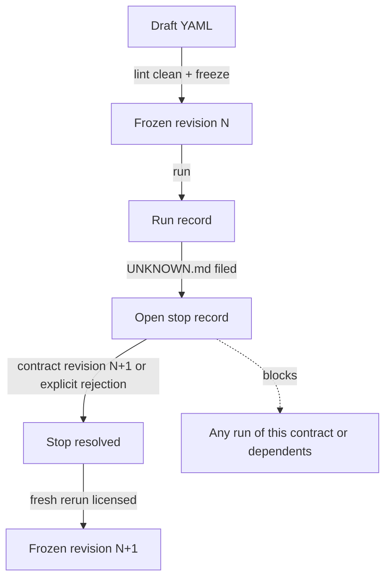
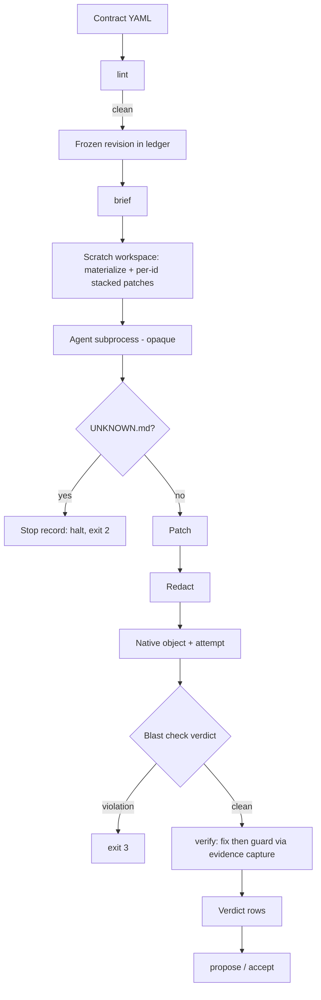

# CCX Native Contracts - Plan

## Goal Capsule

- **Objective:** Turn the validated `tools/ccx` file-and-script harness into Forge product surface. Contracts, runs, stops, and verdicts become first-class signed ledger object kinds. The harness pipeline (lint, brief, blast, run recording, halt-on-unknown, fix/guard verification) becomes `forge contract` subcommands. Substance is unchanged from the requirements-only plan.
- **Authority hierarchy:** this plan governs; then repo conventions in `CLAUDE.md`; then implementer judgment. Product authority is Jan Skolte, via `docs/handoffs/2026-07-10-ccx-harness-to-rust-brainstorm.md` and the two dogfood triage records.
- **Execution profile:** single Rust Cargo workspace. Every change passes the verify trio (`fmt --check`, `test --workspace`, `clippy -D warnings`) plus `scripts/ci.sh` before it is considered done.
- **Stop conditions:** STOP and surface instead of guessing when a schema or record-shape decision contradicts this plan; when a non-negotiable invariant would be weakened (the three stop-gate legs, the fix/guard exit-code split, the cargo-only eval grammar, redact-before-sign ordering); or when `crates/forge-content-native/src/lib.rs` would exceed its 4730-line cap or any file its 3000-line ceiling.
- **Open blockers:** none.
- **Product Contract preservation:** changed during planning enrichment, confirmed by product authority — added R23–R27 and AE9–AE11 (agent-operator surface; run→lifecycle linkage) plus the cold-start criterion wording; R13's and Key Decisions' verdict-representation deferral now points at KTD4; Outstanding Questions resolved and removed (run↔lifecycle → R27/KTD8, fix/guard-vs-CheckSpec → KTD4, exit-code coexistence → KTD10, global-policy representation → U3, ledger schema details → U1, subcommand naming → KTD5/KTD10) with two new deferred-to-implementation items added; Scope Boundaries gained three deferrals (multi-stop triage ordering, concurrent chain runs, trust-gated repo-config agent command). Post-review refinements confirmed by product authority: R27 pinned to integrate-time attempt creation (KTD8); run exit code 1 added for failed runs (R14, harness parity); the agent command is explicit-flag-only in v1. All other Product Contract text is unchanged.

---

## Product Contract

### Summary

Contract-driven agent work becomes native Forge surface: a new family of ledger object kinds (contract, run, stop, verdict) with real lifecycles, operated through `forge contract` subcommands that replace every harness stage except the agent invocation itself. The stop-on-unknown gate's three legs and the fix/guard verification split carry over intact, with triage-before-rerun upgraded from human convention to machine enforcement.

### Problem Frame

The CCX pilot and two dogfoods proved that contract-scoped briefs plus a stop-on-unknown gate convert agent hallucination pressure into typed, triageable signal (13/13 observed stops; a real contract contradiction caught six minutes into implementation). But the harness is deliberately files-and-scripts: runs, stops, and verdicts live outside the signed ledger, the two hardest invariants are enforced only by operator discipline, and no other Forge user can pick the loop up. The 2026-07-06 brainstorm's decision rule — Forge-native substrate only after the harness and dogfoods validate the model — is now satisfied.

### Key Decisions

- **Full first-class objects, not a thin registry.** Contracts, runs, stops, and verdicts each become ledger object kinds with their own lifecycles, uniformly covered by signing, `forge doctor`, and trust policy. This is the larger schema bet (the contract model has two dogfoods of evidence behind it), accepted for uniform enforcement and queryability; the doc-review gate on this plan is the backstop on the pinned shapes. One carve-out: whether fix/guard verdicts are their own kind or extend the existing check-verdict model is resolved in the Planning Contract (KTD4).
- **Staged stability.** The ledger kinds and their JSON envelope surfaces become adopter-grade stable when the R21 retirement dogfood completes on the native surface; until then they are dogfood-grade, like the runner ergonomics. No external adopter exists before that point (v1 is local-only and the scripts stay authoritative), so this keeps one validated-in-anger revision window open before the append-only-forever commitment locks. Runner ergonomics, triage UX, and brief presentation remain dogfood-grade past that point and may iterate.
- **Native everything except agent session management.** `forge` owns lint, brief emission, blast checking, run recording, halt-on-unknown, and fix/guard verification. During a run, forge executes the configured agent command (`claude -p ...` or equivalent) as an opaque subprocess and captures its exit status directly — this is how R7's exit metadata and R11's abnormal-end detection are observed. Forge does no agent session management: no retries, authentication, interactivity, or lifecycle supervision beyond running the configured command once.
- **`UNKNOWN.md` stays the agent-facing act.** The validated stop convention wording is carried verbatim; agents still write a plain file at the repo root. Forge ingests that file into a typed stop record — the stop itself does not become a forge command an agent must learn.
- **YAML stays the authoring format.** Contract authoring remains editing a `ccx.contract.v1` YAML file; the native object is the ledger record of a linted, frozen revision of that file. Authoring does not move into CLI flags.
- **Local-only v1.** The new kinds are signed and doctor-verified locally; peer-sync manifest coverage and Git export are explicitly deferred to a follow-up slice with its own sync-format version bump.

### Actors

- A1. **Contract author** — writes and revises contract YAML, triages stops, owns freeze decisions.
- A2. **Operator** — drives chains: runs tasks, invokes verification, integrates accepted patches. May be a human or an orchestrating agent.
- A3. **Implementation agent** — fresh session per task; consumes a brief, produces a patch or an `UNKNOWN.md` stop. Never interacts with contract objects directly.
- A4. **forge CLI** — records every lifecycle event in the ledger; enforces the gates.

### Requirements

**Contract objects and lifecycle**

- R1. A contract is a first-class ledger object kind identified by contract id plus integer revision; each frozen revision is immutable and stores the exact source YAML bytes (no re-serialization or normalization), so brief emission can reproduce harness output byte-for-byte.
- R2. The contract lifecycle is draft → frozen, with revision bumps creating new frozen revisions; only lint-clean frozen revisions can produce briefs or runs.
- R3. Contract ingestion accepts `ccx.contract.v1` YAML with strict unknown-key rejection: any top-level key outside the schema is an error, not a warning. `ccx.contract.v0` support is out of scope for the native surface.
- R4. Contract lint is a `forge` subcommand enforcing the six existing rule families (shape, satisfiability, primitives existence/visibility, acceptance non-vacuity, exclusion clause, command grammar) with v1-level strictness.
- R5. The brief emitter is a `forge` subcommand and remains a byte-stable pure function of the frozen contract revision, its declared neighbors, and the global policy; the global-policy prepend behavior is preserved.
- R6. The task-instruction stop-rule wording travels verbatim into every emitted brief; the native surface must not editorialize it.

**Runs, stops, and verdicts**

- R7. Every task run is recorded in the ledger: contract id and revision, base state, dependency stack, outcome, and captured artifacts (patch, blast result, agent exit metadata).
- R8. A run that leaves `UNKNOWN.md` in the workspace halts the chain; forge ingests the file into a typed stop record carrying the four required fields (what is needed, why the brief does not answer it, kind, file:line evidence) and linking run and contract revision (Leg 1). Ingestion is fail-closed: the presence of `UNKNOWN.md` always halts the chain and always opens a stop record even when the four fields cannot be fully extracted — missing fields are recorded best-effort and the record is marked malformed; a malformed stop still counts as a success pending triage (R9) and still blocks reruns (R10).
- R9. Stops are recorded and surfaced as success outcomes pending triage — as a distinct record kind, never as a run failure — in every tally, log, and status surface (Leg 2).
- R10. Triage-before-rerun is machine-enforced (Leg 3): forge refuses to run any task whose contract, or any contract in its dependency closure, has an open stop record. Resolution is either a contract revision or an explicit rejection citing the licensing clause; both are recorded on the stop record, and both create a new frozen revision — an explicit rejection bumps the revision recording the rejection rationale without changing contract content, carrying over the harness triage convention.
- R11. An agent session that ends abnormally without filing `UNKNOWN.md` records a failed run; an empty patch never passes as success, and dependents do not execute (crashed-agent invariant).
- R12. Blast-radius violations are recorded as check verdicts against the run; the default-forbid list (`.forge/**`, env files, key and credential paths) is preserved and not weakenable per-contract.
- R13. Fix/guard verification is a `forge` subcommand; each acceptance entry's pass/fail outcome and the aggregate verdict are recorded in the ledger, and guard commands always run even when a fix command failed, so the record is complete. The verdict representation is resolved in the Planning Contract (KTD4).
- R14. The exit-code semantics are preserved exactly: run — 0 all tasks ran, 1 run failed (crashed agent or empty patch, R11, matching the harness's exit-1 convention), 2 stop filed (success pending triage), 3 blast violation; verify — 0 fix and guard green, 2 fix set failed, 4 fix green but guard regressed. Each nonzero outcome also carries a typed code in the JSON envelope, and a stop is never represented as an envelope error.
- R27. A completed run's patch is stored on the run record; at integration time — once the task's dependencies are accepted into HEAD — the patch is re-applied onto HEAD and materializes as an attempt linked to the run and to contract@revision, flowing through the existing save→propose→accept lifecycle with accept's HEAD == base_head invariant unchanged. "Integration into the stack" (R22) means accepting that proposal, in dependency order.

**Security and integrity invariants**

- R15. Acceptance commands remain constrained to the reviewed command grammar (`cargo test|clippy|fmt|build|run`, no shell metacharacters), enforced identically at lint time and at execution time; the verifier is fail-closed standalone and never executes a command outside the grammar. No regression of the current eval-sink hardening.
- R16. Run and verification command output is captured through the existing evidence pipeline, inheriting the excerpt cap and secret redaction. The same secret-redaction pass is applied to captured patch artifacts (R7) and to the stop record's four ingested free-text fields (R8) before those records are written to the ledger and signed — agent-authored content never enters an append-only record unredacted.
- R17. Contract, run, stop, and verdict records carry local Ed25519 signatures under the existing trust-level conventions, and `forge doctor` verifies them.
- R18. Mutating contract subcommands accept `--request-id` with the existing idempotent-replay and conflict semantics.

**Operational hardening (dogfood learnings designed in)**

- R19. Every operand path is canonicalized at argument boundaries (NER-384/385 family).
- R20. Dependency-stack acknowledgement is per-id, not a count guard: the runner names exactly which out-of-chain dependency each supplied patch satisfies and refuses mismatches. No silent caps anywhere in the surface — any bounded behavior reports what was excluded.

**Agent-operator surface**

- R23. Every record kind this plan introduces is readable via `--json` subcommands: list open stops (contract id, revision, four fields, malformed flag), show a run record with per-task outcomes and tally, show a contract's current frozen revision and its blocked/runnable status, and list verdicts for a run.
- R24. Stop resolution — a revision-bump link or an explicit rejection with rationale — is a mutating subcommand covered by R18 idempotency, emitting the resolved stop record in its envelope.
- R25. `forge contract run` and `verify` envelopes carry a machine-readable `outcome` discriminator in `data` (run: completed | stopped | blast_violation | failed; verify: passed | fix_failed | guard_regressed) plus the referenced record ids — exit codes and envelope encode the same state redundantly; a stop pairs exit 2 with envelope status success. A malformed ingested stop surfaces as a distinct field and typed code so an operator knows fields need reconstruction.
- R26. `contract run` refuses to start when `UNKNOWN.md` already exists at the workspace root — a typed error in the DIRTY_WORKTREE-family preflight — so a stale file cannot be attributed to the wrong run.

**Migration and parity**

- R21. `tools/ccx` scripts remain authoritative until a full dogfood chain (contract authoring through verification and triage) completes on the native surface with zero script glue except the agent invocation; that run is the retirement criterion for the overlapping script stages.
- R22. Contract acceptance green licenses integration of a task's output into the stack — never merge. The `/ce-code-review` gate stays non-optional and outside this surface.

### Key Flows

- F1. **Author and freeze**
  - **Trigger:** A1 writes or revises contract YAML.
  - **Steps:** Ingest → lint (R3, R4) → freeze as revision N (R1, R2).
  - **Outcome:** A frozen, lint-clean revision runnable by A2.
- F2. **Chain run with a stop**
  - **Trigger:** A2 runs a dependency-ordered chain.
  - **Steps:** Brief emitted (R5, R6) → agent session (A3) → `UNKNOWN.md` filed → stop record ingested, chain halts with exit 2 (R8, R14) → A1 triages: revision bump or explicit rejection (R10) → fresh rerun licensed.
  - **Outcome:** The stop is tallied as a success pending triage (R9); nothing dependent executed against an unanswered unknown.
- F3. **Independent verification**
  - **Trigger:** A2 verifies a completed task on a rebuilt base.
  - **Steps:** Fix set executes → guard set executes regardless of fix outcome (R13) → verdict records written.
  - **Outcome:** Exit 0/2/4 per R14, mechanically distinguishing not-done from works-but-regressed.

### Acceptance Examples

- AE1. **Covers R8, R9, R14.** Given a chain of two tasks where task 1's agent files `UNKNOWN.md`, when the run halts, then the exit code is 2, the stop record is open with all four fields, task 2 never executed, and the run tally reports task 1 as a successful stop, not a failure.
- AE2. **Covers R10.** Given a contract with an open stop record, when the operator attempts to run it or any dependent, then forge refuses with a typed error naming the open stop, and no agent session starts.
- AE3. **Covers R13, R14.** Given a task whose fix set passes and one guard command regresses, when verification completes, then the exit code is 4, the envelope carries the guard-regression typed code, and per-command verdict records exist for every entry including the failed guard.
- AE4. **Covers R3.** Given a contract YAML with an unrecognized top-level key, when it is ingested or linted, then the result is an error naming the key, and no frozen revision is created.
- AE5. **Covers R11, R14.** Given an agent session that exits nonzero without filing `UNKNOWN.md` and without producing a patch, when the run is recorded, then its outcome is failed, the run exit code is 1, and dependent tasks are not executed.
- AE6. **Covers R15.** Given an acceptance entry containing a shell metacharacter or a non-cargo command, when linted or executed, then both surfaces refuse it with the same grammar violation.
- AE7. **Covers R12, R14.** Given a task run whose produced patch touches a path on the default-forbid list (for example `.forge/`), when the blast check runs, then the exit code is 3, a check verdict record exists against the run naming the forbidden path, and no dependent task executes.
- AE8. **Covers R11, R14.** Given an agent session that exits zero and produces an empty patch (zero-delta diff, no file changes), when the run is recorded, then its outcome is failed, the run exit code is 1, and dependent tasks are not executed.
- AE9. **Covers R23, R10.** Given two contracts each with an open stop, when the operator queries open stops via `--json`, then both are listed with their triageable fields (contract id, revision, four fields, malformed flag); and when a dependent's run is refused, the refusal names the blocking stop id.
- AE10. **Covers R26.** Given a stale `UNKNOWN.md` at the workspace root before a run starts, when `contract run` is invoked, then it refuses with a typed error, no agent session starts, and no stop record is created.
- AE11. **Covers R25.** Given the AE1, AE3, and AE7 scenarios, when their envelopes are asserted, then each carries the correct status, `data.outcome` discriminator, typed code, and referenced record ids — in addition to the exit codes those examples already assert.

### Success Criteria

- A dogfood chain equivalent to dogfood #2 (multi-task, dependency-ordered, with at least one induced stop and triage cycle) completes end-to-end through native subcommands, with the agent invocation as the only script glue (R21).
- `forge doctor` passes over a repository containing the full new-kind population, verifying their signatures and chain integrity.
- The plan's reviewers can trace every non-negotiable invariant (three legs, fix/guard split, eval-sink constraint) to a requirement and an acceptance example in this document.
- A cold-start operator who did not author the harness or this plan can drive a full contract chain (author → freeze → run → stop → triage → verify) from the shipped command surface and its documentation alone. That operator may be an agent given only `--json` output and `forge schema` — closing the Problem Frame's "no other Forge user can pick the loop up" pain.

### Scope Boundaries

**Deferred for later**

- Peer-sync manifest coverage and Git export of the new kinds (sync-format version bump is its own slice).
- Compiler-grade primitive resolution for lint rule 3 (rustdoc-JSON); v1 keeps parity with the current text-search approach.
- `ccx.contract.v0` ingestion; the frozen pilot record stays in script-land and forge-research.
- Widening the acceptance command grammar beyond the cargo family.
- Multi-stop triage ordering policy: when several stops are open, forge lists all but does not prescribe a resolution order.
- Concurrent chain runs: v1 is single-run-at-a-time per repo; parallel runs against one repo are deferred.
- A repo-config source for the agent command, behind a local trust gate; v1 is explicit-flag-only.

**Outside this surface's identity**

- Agent session management: spawning, supervising, authenticating, or retrying agent processes.
- Merge gating: contract acceptance never substitutes for `/ce-code-review` or human-approved merges.

### Dependencies / Assumptions

- Assumes two dogfoods are sufficient evidence to pin the contract/run/stop/verdict record shapes; the doc-review gate on this plan and the staged-stability decision are the mitigations.
- Assumes the existing evidence, signing, doctor, and request-id machinery generalize to new record kinds without redesign (verified present: forge-evidence excerpt/redaction, Ed25519 trust levels, idempotent replay).
- NER-388 (shared typed `UNKNOWN_COMMIT`) is adjacent but not a prerequisite.

### Outstanding Questions

**Deferred to implementation**

- Malformed-stop reconstruction UX: how an operator supplies the missing four fields after a best-effort ingest is settled in U8's triage surface.

### Sources / Research

- tools/ccx/CONTRACT-SCHEMA.md — the de-facto v1 schema being formalized (fix/guard semantics, command grammar, depends_on vs neighbors).
- tools/ccx/UNKNOWN-TRIAGE.md and docs/solutions/design-patterns/stop-on-unknown-gate-for-agent-briefs.md — the three-leg gate this plan preserves; 13/13 observed stops validate the wording R6 protects.
- docs/code-reviews/2026-07-07-ner362-dogfood.md, docs/code-reviews/2026-07-10-ner386-387-dogfood2.md — what the gates caught per run; dogfood #2's zero-fix run is the trigger for this plan.
- docs/plans/2026-07-06-001-feat-ccx-thin-harness-plan.md Open Questions — carried items landing here: per-id stack matching (R20), lint/CI entry point and verify ownership (planning), triage-log format (subsumed by stop records).
- docs/brainstorms/2026-07-06-context-closed-tasks-v3.md §4/§5 — the decision rule licensing the substrate build now.
- Verified repo grounding: no fix/guard tiering in the current check engine; attempts model intent+base_head sessions; versioned sync manifests with a v1→v2 bump precedent; trust-level constants; evidence excerpt cap and redaction ordering; count-only stack guard and unknown-key lint tolerance in the current harness.

---

## Planning Contract

### Key Technical Decisions

- KTD1 **Object kinds follow the embargo exemplar.** One migration (next free slot: `crates/forge-store/migrations/022_contracts.sql`) defines per-kind tables with lifecycle-state CHECK constraints; a new `forge-store` domain module `crates/forge-store/src/contract.rs` owns all behavior; `crates/forge-store/src/lib.rs` (195 lines, a facade) carries re-exports only. Rationale: `021_embargo_workflow.sql` plus `crates/forge-store/src/embargo.rs` is the working precedent for a full new object family added as one migration and one domain module without touching the facade.
- KTD2 **Signing and doctor are two-sided in the same slice.** Sign via `LocalSigner::sign_subject` with new `subject_kind` strings (`"contract"`, `"contract_run"`, `"contract_stop"`) over canonical content hashes, chained through `insert_operation_view_chained`; extend `forge doctor` BOTH in the tamper-chain re-walk AND in `expected_signed_subjects` (`crates/forge-store/src/signing.rs:672`) with per-kind high-water markers so pre-migration rows are not retro-flagged. Rationale: `crates/forge-store/src/evidence.rs` is the pattern for sign-then-chain, and doctor coverage that omits either side leaves an unverified kind; this is one slice, not a deferral.
- KTD3 **Redact before sign, in-transaction.** Stop free-text fields and patch content pass the `redact_evidence_excerpt`-family redaction BEFORE hashing and signing, inside the same transaction (per the tamper-evident-evidence-chain solution doc). Patch artifacts are stored as FULL redacted native content objects — not 4096-byte excerpts, since the excerpt cap applies to command output only — and their ObjectIds are added to the GC reachability roots (`crates/forge-store/src/gc.rs`, `ledger_commit_roots`) in the same slice. Rationale: a new ObjectKind that is not a GC root is a data-loss bug, per the new-ObjectKind/GC-coupling solution doc.
- KTD4 **Verdicts are contract-owned, not CheckSpec.** Contract acceptance (fix/guard command lists on the frozen revision) is evaluated by executing each command through `forge-evidence` capture-with-timeout and recording per-command verdict rows in the run family; `forge-policy`'s intent-scoped `CheckSpec` is untouched in v1. Rationale: `CheckSpec` identity is per-intent and snapshot-scoped, whereas contract acceptance is per-revision and rebuilt-base-scoped — reusing it would overload two session models. This resolves the plan's deferred fix/guard-vs-CheckSpec question.
- KTD5 **CLI family layout mirrors embargo.** `Contract(ContractArgs)` lands in `crates/forge-cli/src/args.rs` (clap derive, the `EmbargoArgs`/`EmbargoCommand` exemplar), a single dispatch arm goes in `main.rs` (facade), and all response logic lives in a NEW `crates/forge-cli/src/commands/contract.rs` registered in `commands/mod.rs`. Rationale: `commands/core.rs` is at 2468/3000 lines; no response or business logic may be added there (ADR-0001) — the only permitted core.rs edits are bounded wiring-table entries (a `locks_repo_for_command` line, schema registration) that existing shared tables require.
- KTD6 **Mutating subcommands reuse `command_result`.** Each mutating subcommand takes the repo advisory lock (add it to `locks_repo_for_command`), does a pre-flight request-id replay check, and re-checks replay inside `BEGIN IMMEDIATE` (per the sqlite-multiprocess solution doc); a `contract run` replay returns the recorded run result and never re-executes the agent subprocess. Typed codes are added as `ForgeError` variants plus `error_registry()` entries (a length test enforces registration), and retryability is classified for the whole new code set at once. Rationale: `command_result` (`crates/forge-cli/src/commands/core.rs:1866`) already threads lock + replay + envelope.
- KTD7 **The runner uses a native scratch workspace, never the user worktree.** Materialize a per-run scratch workspace via `materialize_content_ref` (`crates/forge-content-native/src/lib.rs:438`, which takes an arbitrary destination and enforces snapshot exclusions) into a temp dir, then apply acknowledged dependency patches on top per-id; UNKNOWN.md detection reads the scratch workspace root. The agent's patch is computed as a forge-content-native tree diff of the post-run workspace against the post-dependency-application state (base plus per-id acknowledged patches), so dependency changes are never misattributed to the agent; that diff is the artifact fed to blast checking, redaction, and the attempt. Rationale: because the scratch path is not the user worktree, `DIRTY_WORKTREE` does not apply to it; the attempt-workspace marker machinery (`crates/forge-store/src/attempts.rs`, migration 009) is the precedent for tracked workspaces.
- KTD8 **Run→lifecycle linkage is integrate-time (R27).** The run stores the raw redacted patch; the attempt is created at integration time by re-applying that patch onto the real HEAD once the task's dependencies are accepted, in dependency order — so `attempt.base_head` is the actual HEAD and accept's `STALE_BASE` invariant is untouched. The attempt's backing intent is synthesized from the contract task (intent text derived from contract id@revision plus task id — `create_attempt` in crates/forge-store/src/attempts.rs already synthesizes an intent when none is supplied), and the synthesized intent id is recorded on the run↔attempt link. A patch that no longer applies at integration time is a typed refusal, not a silent merge. Rationale: this reuses the save→propose→accept path unchanged rather than teaching accept about synthetic composite bases.
- KTD9 **Rerun-after-triage resumes from the halted task.** A rerun replays against recorded, per-id acknowledged completed-task outputs and restarts at the halted task; a fresh full-chain run remains available. Run records carry per-task completion state to support this.
- KTD10 **Typed-code inventory is a registered deliverable.** At minimum: CONTRACT_LINT_FAILED, CONTRACT_NOT_FROZEN, CONTRACT_OPEN_STOP (a refused run names the blocking stop ids), STALE_UNKNOWN_FILE, CONTRACT_STOP_MALFORMED (a flag, not a failure), CONTRACT_BLAST_VIOLATION, CONTRACT_GUARD_REGRESSED, CONTRACT_FIX_FAILED, plus a command-grammar-violation code — all registered in `forge schema`. Names are directional; final naming happens at implementation. Exit-code mapping: process exit codes 0/1/2/3 (run — 1 is the failed outcome per R11/R14, the harness's run-task.sh precedent) and 0/2/4 (verify) are preserved exactly, and envelope status is success for stops per R25. This pins the former exit-code-coexistence question.

### High-Level Technical Design

The contract-lifecycle mermaid in the Product Contract (draft → frozen → run → stop → resolved) stays as-is; this diagram adds the execution and storage path the units implement.

### Assumptions

- Two dogfoods pin the YAML schema; the risk that a third would move it is mitigated by staged stability tied to the R21 retirement dogfood.
- A1 (contract author and triager) may be human or agent in v1 — there is no human-only gate on rejection; R22's merge boundary remains the human gate.
- Single-run-at-a-time per repo; concurrent chain runs are deferred.

### Sources / Research

- Exemplar paths: `crates/forge-store/migrations/021_embargo_workflow.sql` and `crates/forge-store/src/embargo.rs` (new object family), `crates/forge-store/src/evidence.rs` (sign-then-chain), `crates/forge-store/src/signing.rs:672` (`expected_signed_subjects`), `crates/forge-store/src/gc.rs` (`ledger_commit_roots`), `crates/forge-content-native/src/lib.rs:438` (`materialize_content_ref`), `crates/forge-store/src/attempts.rs` (workspace markers, migration 009), `crates/forge-cli/src/commands/core.rs:1866` (`command_result`), `crates/forge-store/src/error.rs:903` (`error_registry`), `crates/forge-cli/tests/forge_blame.rs` (22-test integration exemplar), `crates/forge-cli/src/commands/sync.rs` (large command module pattern), `crates/forge-cli/src/args.rs:466` (`EmbargoArgs`).
- Solution docs (all under docs/solutions/): architecture-patterns/schema-migration-reconciliation-and-typed-error-contract-2026-05-29.md, architecture-patterns/native-commit-objects-base-anchoring-and-the-new-objectkind-gc-reachability-coupling-2026-05-30.md, architecture-patterns/tamper-evident-evidence-chain-and-failclosed-verification-2026-05-30.md, architecture-patterns/sqlite-multiprocess-concurrency-and-idempotent-replay-2026-05-29.md, architecture-patterns/filesystem-enumeration-shared-exclusion-contract.md, conventions/contract-acceptance-is-not-merge-ready.md.
- Harness semantics being ported: tools/ccx/ccx-lint.py (six rule families, command grammar), tools/ccx/ccx-brief.py (byte-stable emission), tools/ccx/ccx-blast.py (envelope/diff modes, facade allowance).

---

## Implementation Units

### U1. Schema and store foundation

Goal: Land migration 022 and the `contract.rs` domain module so every new kind can be inserted, queried, signed, and chained.

Requirements: R1, R2, R7, R17, R18 (store-level); KTD1, KTD2; foundation for all later units.

Dependencies: none.

Files: crates/forge-store/migrations/022_contracts.sql, crates/forge-store/src/contract.rs, crates/forge-store/src/lib.rs, crates/forge-store/src/migrations.rs, crates/forge-store/src/error.rs.

Approach: Migration 022 creates the contracts, contract_revisions (or a combined contract+revision table), contract_runs plus per-task run rows, contract_stops, and contract_run_verdicts tables, each with lifecycle-state CHECK constraints. The `contract.rs` module holds insert and query functions and signs each row via `sign_subject` chained through `insert_operation_view_chained`. The facade `lib.rs` gains `pub use` re-exports only. Request-id columns and replay wiring are added so later mutating subcommands can reuse them.

Patterns to follow: crates/forge-store/src/embargo.rs and migration 021 (table + domain module shape); crates/forge-store/src/evidence.rs (sign-then-chain).

Test scenarios: insert a frozen revision and read it back (happy); reject a lifecycle-state transition the CHECK forbids (error); a revision-bump row references its predecessor (integration); a signed row's subject verifies (happy).

Verification: store unit tests in the domain module pass; migration applies cleanly on a fresh db; verify trio green.

### U2. Typed codes and envelope outcome discriminator

Goal: Register the full typed-code inventory and the `outcome` discriminator before any unit asserts against them.

Requirements: R14, R25; KTD6, KTD10.

Dependencies: U1.

Files: crates/forge-store/src/error.rs, crates/forge-cli/src/commands/core.rs (schema registration only — bounded wiring per KTD5).

Approach: Add the KTD10 codes as `ForgeError` variants with `error_registry()` entries and retryability classification. Define the `outcome` discriminator values for run and verify; the CLI-side wiring into response `data` lands in U3 when `commands/contract.rs` is created. Ensure `forge schema` lists the new codes so an agent operator can enumerate them.

Patterns to follow: crates/forge-store/src/error.rs:903 (`error_registry`) and its length test.

Test scenarios: the registry length test passes with the new codes (happy); each new code round-trips through `forge schema --json` (integration); an unregistered code fails the length test (error, negative control).

Verification: length test green; `forge schema` output contains every KTD10 code.

### U3. Contract ingest, lint, and freeze

Goal: `forge contract lint|freeze` ingest `ccx.contract.v1` YAML, enforce the six rule families, and record a signed frozen revision.

Requirements: R2, R3, R4, R15 (lint half), R19; AE4, AE6; KTD5.

Dependencies: U1, U2.

Files: crates/forge-cli/src/args.rs, crates/forge-cli/src/main.rs, crates/forge-cli/src/commands/contract.rs, crates/forge-cli/src/commands/mod.rs, crates/forge-store/src/contract.rs, crates/forge-cli/tests/forge_contract.rs.

Approach: Port ccx-lint.py semantics: strict unknown-key rejection (R3), the six rule families including command grammar and metacharacter rejection as one shared function reused at execution time, satisfiability against the `scripts/check-rust-line-count.sh` caps, and primitive existence/visibility. Sanctioned native strictness beyond the harness: unknown top-level keys error, `ccx.contract.v0` is rejected, and the linted contract's own id must correspond to its filename (the harness only checked this for neighbor resolution). Freeze records a signed, lint-clean revision storing the exact source bytes (R1). The global policy is decided here: a repo-level `_global-policy.yaml` file with a reserved contract id remains the source, ingested and frozen like a contract. This unit scaffolds the CLI family (args, main arm, module, mod registration) and wires U2's `outcome` discriminator into the response `data`.

Patterns to follow: crates/forge-cli/src/args.rs:466 (`EmbargoArgs`); tools/ccx/ccx-lint.py (rule semantics); crates/forge-cli/src/commands/sync.rs (command module shape).

Test scenarios: Covers AE4 — an unrecognized top-level key errors naming the key, no frozen revision created (error). Covers AE6 — an acceptance entry with a shell metacharacter or non-cargo command is refused at lint (error). A lint-clean v1 contract freezes and reads back as revision 1 (happy). A primitive named with wrong visibility errors (error). Path operands are canonicalized (edge, R19).

Verification: integration cases pass in forge_contract.rs; the shared grammar function is the single source reused by U7.

### U4. Brief emission

Goal: `forge contract brief` emits a byte-stable brief that matches the harness output for the same inputs.

Requirements: R5, R6.

Dependencies: U3.

Files: crates/forge-cli/src/commands/contract.rs, crates/forge-store/src/contract.rs.

Approach: Implement brief emission as a pure function of the frozen revision, its declared neighbors, and the global policy, prepending global policy and appending the verbatim task-instruction stop wording. Compare byte-for-byte against tools/ccx/ccx-brief.py output for shared fixture inputs.

Patterns to follow: tools/ccx/ccx-brief.py (ordering and byte-stability).

Test scenarios: the same input emitted twice is byte-identical (happy); the native brief equals the ccx-brief.py brief for a shared fixture (integration, fixture comparison); the task-instruction wording appears verbatim (happy, R6).

Verification: fixture-comparison test green.

Execution note: write the byte-stability fixture comparison first; it is the contract for this unit.

### U5. Run recording, halt-on-unknown, and stop ingestion

Goal: `forge contract run` executes the agent in a scratch workspace, records the run, halts on `UNKNOWN.md`, and links a completed patch into the lifecycle.

Requirements: R7, R8, R9, R10, R11, R16, R20, R26, R27; AE1, AE2, AE5, AE8, AE9 (refusal half), AE10; KTD3, KTD6, KTD7, KTD8, KTD9.

Dependencies: U1, U2, U3, U4.

Files: crates/forge-cli/src/commands/contract.rs, crates/forge-store/src/contract.rs, crates/forge-store/src/attempts.rs (linkage), crates/forge-cli/src/commands/core.rs (`locks_repo_for_command` entry — bounded wiring per KTD5), crates/forge-cli/tests/forge_contract.rs.

Approach: Materialize a per-run scratch workspace via `materialize_content_ref`, apply per-id acknowledged dependency patches (R20), and preflight-refuse a stale `UNKNOWN.md` (R26). Execute the opaque agent command — taken only from an explicit run flag; there is no repo-config fallback in v1 (a repo-shipped command source is a supply-chain surface) — and capture exit metadata. Ingest a filed `UNKNOWN.md` fail-closed, marking it malformed when the four fields cannot be extracted (R8), redact then sign the stop, and halt the chain with exit 2. A crashed agent or empty patch is a failed run with exit 1 and no dependents executed (R11, R14). A completed patch is redacted and stored as a full native object added to GC roots; an integrate subcommand later re-applies it onto HEAD as an attempt per KTD8 (R27). Leg-3 refusal walks the dependency closure for open stops (R10), and rerun resumes from the halted task (KTD9).

Patterns to follow: crates/forge-content-native/src/lib.rs:438 (`materialize_content_ref`); crates/forge-store/src/attempts.rs (workspace markers, attempt linkage); crates/forge-store/src/evidence.rs (redact-then-sign); crates/forge-store/src/gc.rs (`ledger_commit_roots`).

Test scenarios: Covers AE1 — two-task chain, task 1 files UNKNOWN.md, exit 2, open stop with four fields, task 2 never runs, tally reports a successful stop. Covers AE2 — a run of a contract or dependent with an open stop is refused with a typed error naming the stop, no agent session starts. Covers AE5 — nonzero agent exit with no UNKNOWN.md and no patch records a failed run, no dependents. Covers AE8 — zero exit with an empty patch records a failed run, no dependents. Covers AE9 (refusal half) — a dependent's run refusal names the blocking stop id. Covers AE10 — a stale UNKNOWN.md at run start yields a typed refusal, no session, no stop record. Integrating a completed run's patch after its dependencies are accepted produces an attempt on the current HEAD linked to the run (integration, R27); integrating before dependencies are accepted, or when the patch no longer applies, is a typed refusal (error, KTD8). A malformed stop is flagged and still blocks reruns (edge, R8/R25).

Verification: all AE-linked cases pass in forge_contract.rs; GC roots include the patch object; doctor verifies the stop signature.

Execution note: this is the riskiest unit; write the stop-ingestion edge cases (malformed, stale, empty-patch) test-first.

### U6. Blast check as a check verdict

Goal: Record blast-radius violations as check verdicts against the run with exit 3.

Requirements: R12, R14; AE7.

Dependencies: U1, U5.

Files: crates/forge-cli/src/commands/contract.rs, crates/forge-store/src/contract.rs, crates/forge-cli/tests/forge_contract.rs.

Approach: Port ccx-blast.py's envelope and diff modes, including the statement-aware facade allowance and the default-forbid list that is not weakenable per-contract (R12). Record a verdict against the run and exit 3 on violation.

Patterns to follow: tools/ccx/ccx-blast.py (facade allowance, default-forbid).

Test scenarios: Covers AE7 — a patch touching `.forge/` yields exit 3, a verdict naming the forbidden path, and no dependent executes. A facade-only statement change is allowed (edge). A default-forbid entry cannot be overridden by contract config (error, R12).

Verification: AE7 passes; default-forbid non-weakenability is asserted.

### U7. Fix/guard verification

Goal: `forge contract verify` runs fix then guards on a rebuilt base and records per-command verdicts with exit 0/2/4.

Requirements: R13, R14, R15 (execution half); AE3; KTD4.

Dependencies: U1, U2, U3, U5.

Files: crates/forge-cli/src/commands/contract.rs, crates/forge-store/src/contract.rs, crates/forge-cli/tests/forge_contract.rs.

Approach: Rebuild the base by reusing KTD7's scratch-workspace materialization — `materialize_content_ref` plus the task's stored patch read from the run record's attempt content ref — then run the fix set, then always run guards even if fix failed (R13), executing every command through `forge-evidence` capture within the cargo-only grammar (R15) using the shared grammar function from U3. Record per-command verdict rows and an aggregate, mapping to exit 0/2/4 (R14). The verifier is fail-closed standalone and never executes outside the grammar.

Patterns to follow: crates/forge-evidence capture-with-timeout; the U3 shared grammar function; crates/forge-content-native/src/lib.rs:438 (`materialize_content_ref`, per KTD7).

Test scenarios: Covers AE3 — fix passes, one guard regresses, exit 4, guard-regression typed code, per-command verdict rows for every entry including the failed guard. Fix failure yields exit 2 and guards still run (edge, R13). A command outside the grammar is refused at execution (error, R15).

Verification: AE3 passes; guards run regardless of fix outcome.

### U8. Query and triage surface

Goal: Ship the `--json` read subcommands and the mutating triage resolve subcommand.

Requirements: R23, R24, R10, R25; AE9 (query half); KTD6.

Dependencies: U1, U5.

Files: crates/forge-cli/src/commands/contract.rs, crates/forge-store/src/contract.rs, crates/forge-cli/tests/forge_contract.rs.

Approach: R23 adds list-open-stops, show-run, show-contract-status, and list-verdicts, each `--json`. R24 adds a triage resolve subcommand that links a revision bump or records an explicit rejection with rationale; both bump the revision per R10 and emit the resolved stop record. Resolve reuses `command_result` for lock, replay, and envelope. Malformed-stop reconstruction (supplying missing fields) is handled here.

Patterns to follow: crates/forge-cli/src/commands/core.rs:1866 (`command_result`); crates/forge-store/src/embargo.rs (query shapes).

Test scenarios: Covers AE9 (query half) — two contracts each with an open stop: list-open-stops returns both with triageable fields including the malformed flag (happy, R23). A revision-bump resolution clears the stop and licenses a rerun (integration, R10). An explicit rejection bumps the revision recording rationale without changing content (edge, R10). Replaying a resolve request-id returns the original result (idempotency, R18).

Verification: query and resolve cases pass; resolved stops unblock the dependency closure.

### U9. Doctor and GC integration and hardening

Goal: Prove two-sided doctor coverage, GC reachability, and path canonicalization for the new kinds.

Requirements: R12 (integrity), R17, R19; KTD2, KTD3.

Dependencies: U1, U5, U6, U7.

Files: crates/forge-store/src/doctor.rs (if extension needed), crates/forge-store/src/gc.rs, crates/forge-cli/tests/forge_contract.rs.

Approach: Add tests proving doctor re-walks the tamper chain AND checks `expected_signed_subjects` for every new kind with per-kind high-water markers, and that patch objects are GC-reachable roots. Audit path canonicalization at every argument boundary (R19).

Patterns to follow: the forge_doctor_gc-style integration tests; crates/forge-store/src/signing.rs:672.

Test scenarios: doctor passes over a repo with the full new-kind population (integration, R17); a tampered stop row fails doctor (error); a patch object survives gc (integration, KTD3); pre-migration rows are not retro-flagged (edge, KTD2).

Verification: doctor green over the full population; gc retains patch objects.

### U10. Native parity dogfood and AE sweep

Goal: One integration file covers AE1–AE11 and the R21-shaped end-to-end scenario, and docs point users to the native surface.

Requirements: R21; all AE1–AE11.

Dependencies: U1–U9.

Files: crates/forge-cli/tests/forge_contract.rs, tools/ccx/README.md (pointer note), a README section for the contract family (crate docs or docs/).

Approach: Write the integration suite mapping each test to its AE with `Covers AE<n>.` prefixes, plus the R21-shaped end-to-end native chain (author → freeze → run → stop → triage → verify) driven in a `/tmp` scratch repo, never the project root. Add the docs section and a pointer note in tools/ccx/README.md. Record the retirement-criterion evidence when the chain runs zero-script-glue.

Patterns to follow: crates/forge-cli/tests/forge_blame.rs (22-test integration exemplar).

Test scenarios: Covers AE1–AE11 — one test per acceptance example, each naming its AE; AE11 specifically asserts, for the AE1/AE3/AE7 scenarios, the envelope status, `data.outcome` discriminator, typed code, and referenced record ids alongside the exit codes. The full native chain completes with the agent invocation as the only script glue (integration, R21).

Verification: every AE has a passing named test; the end-to-end chain is green in a /tmp scratch repo.

---

## Verification Contract

- `rtk cargo fmt --all --check`; `rtk cargo test --workspace`; `rtk cargo clippy --workspace --all-targets -- -D warnings` — all must pass; clippy warnings are hard failures.
- `rtk bash scripts/ci.sh` mirrors CI including the e2e eval.
- `scripts/check-rust-line-count.sh` — the 3000-line ceiling holds; `crates/forge-content-native/src/lib.rs` must not exceed 4730.
- New-feature proof: the `crates/forge-cli/tests/forge_contract.rs` integration suite covering AE1–AE11, plus the U10 end-to-end native chain dogfood in a `/tmp` scratch repo (never the project root — CLAUDE.md gotcha).
- Harness self-tests under `tools/ccx/tests` remain green; the scripts stay authoritative until the R21 retirement criterion is met.

---

## Definition of Done

Global:

- All units landed; the verification contract is green.
- Every AE has a passing test that names it.
- `forge doctor` is green over a repository containing the full new-kind population.
- Typed codes are registered and the length test is green.
- No file exceeds its line ceiling.
- Abandoned experimental code is removed and docs are updated.
- The `/ce-code-review` gate is run on the branch diff before the PR (non-optional per repo conventions).
- Plan cross-references are updated when this file moves to docs/plans/completed/.

Per-unit: each unit's Verification outcomes are met.
